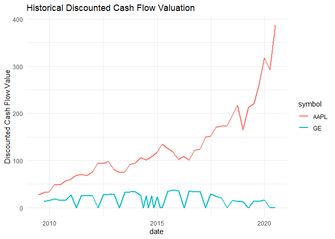

<!-- README.md is generated from README.Rmd. Please edit that file -->

# fmpapi: An R package for interfacing with the Financial Modeling Prep API 

<!-- badges: start -->

[](https://CRAN.R-project.org/package=fmpapi)
[](https://www.tidyverse.org/lifecycle/#maturing)
<!-- badges: end -->

The goal of `fmpapi` is to provide a simple and consistent interface to
the **Financial Modeling Prep** [Financial Data
API](https://financialmodelingprep.com/) that can be used along side and
integrated with other common R resources for collecting and analyzing
financial data, such as `tidyquant`, `xts`, `TTR`, and `quantmod`.

## Installation

<!-- You can install the released version of fmp from [CRAN](https://CRAN.R-project.org) with: -->

<!-- --- actually not on CRAN yet -->

<!-- ``` r -->

<!-- install.packages("fmp") -->

<!-- ``` -->

You can install the latest development version of fmp from
[Github](https://github.com) with:

``` r
remotes::install_github('jpiburn/fmpapi')
```

## Getting Started

Before getting started with `fmp` you first must obtain an API key for
the Financial Modeling Prep Financial Data API. For details, see
[here](https://financialmodelingprep.com/developer/docs/pricing/).

Once you sign up, you can add your API key to your `.Renviron` file by
using `fmp_api_key()`. This will add a `FMP_API_KEY` entry to your
`.Renviron` file so it will automatically be available in future
sessions. When first installed however, you will need to reload your
.Renviron file by either restarting R or running
`readRenviron('~/.Renviron')`

``` r
library(fmpapi)

api_key <- 'my_api_key'
fmp_api_key(api_key)

# reload
readRenviron('~/.Renviron')
```

## Company Information and Financials

``` r
library(fmpapi)
library(tidyverse)

my_stocks <- c("AAPL", "GE")

d <- fmp_profile(my_stocks)

glimpse(d)
#> Rows: 2
#> Columns: 26
#> $ symbol              <chr> "AAPL", "GE"
#> $ price               <dbl> 462.25, 6.44
#> $ beta                <dbl> 1.228499, 1.177065
#> $ vol_avg             <dbl> 36667309, 94472273
#> $ mkt_cap             <dbl> 1.976410e+12, 5.637119e+10
#> $ last_div            <dbl> 3.18, 0.04
#> $ range               <chr> "201.0-464.35", "5.48-13.26"
#> $ changes             <dbl> 3.82, -0.03
#> $ company_name        <chr> "Apple Inc.", "General Electric Company"
#> $ exchange            <chr> "Nasdaq Global Select", "New York Stock Exchange"
#> $ exchange_short_name <chr> "NASDAQ", "NYSE"
#> $ industry            <chr> "Consumer Electronics", "Specialty Industrial M...
#> $ website             <chr> "http://www.apple.com", "http://www.ge.com"
#> $ description         <chr> "Apple Inc. designs, manufactures, and markets ...
#> $ ceo                 <chr> "Mr. Timothy D. Cook", "Mr. H. Lawrence Culp Jr."
#> $ sector              <chr> "Technology", "Industrials"
#> $ country             <chr> "United States", "United States"
#> $ full_time_employees <dbl> 137000, 205000
#> $ phone               <chr> "408-996-1010", "617-443-3000"
#> $ address             <chr> "One Apple Park Way", "5 Necco Street"
#> $ city                <chr> "One Apple Park Way", "5 Necco Street"
#> $ state               <chr> "CA", "MA"
#> $ zip                 <chr> "95014", "02210"
#> $ dcf_diff            <dbl> 89.92, 21.63
#> $ dcf                 <dbl> 297.11, 30.90
#> $ image               <chr> "https://financialmodelingprep.com/image-stock/...
```

## Discounted Cash Flow Valuation

``` r

fmp_dcf(my_stocks, historical = TRUE, quarterly = TRUE) %>%
  ggplot(
    aes(x = date, y = dcf, colour = symbol)
    ) +
  geom_line(size = 1) +
  theme_minimal() +
  labs(
    title = "Historical Discounted Cash Flow Valuation",
    y = "Discounted Cash Flow Value"
  )
```



## Key Metrics

``` r
d <- fmp_key_metrics(my_stocks)

glimpse(d)
#> Rows: 73
#> Columns: 59
#> $ symbol                                      <chr> "AAPL", "AAPL", "AAPL",...
#> $ date                                        <date> 2019-09-28, 2018-09-29...
#> $ revenue_per_share                           <dbl> 55.964480, 53.117842, 4...
#> $ net_income_per_share                        <dbl> 11.885789216, 11.905940...
#> $ operating_cash_flow_per_share               <dbl> 14.92628492, 15.4864624...
#> $ free_cash_flow_per_share                    <dbl> 12.668767946, 12.823920...
#> $ cash_per_share                              <dbl> 10.5065421, 5.1824870, ...
#> $ book_value_per_share                        <dbl> 19.4643350, 21.4289328,...
#> $ tangible_book_value_per_share               <dbl> 72.816162, 73.143405, 6...
#> $ shareholders_equity_per_share               <dbl> 19.4643350, 21.4289328,...
#> $ interest_debt_per_share                     <dbl> 21.80359151, 21.7873250...
#> $ market_cap                                  <dbl> 1.157812e+12, 1.061223e...
#> $ enterprise_value                            <dbl> 1.206755e+12, 1.141009e...
#> $ pe_ratio                                    <dbl> 20.953594, 17.826395, 1...
#> $ price_to_sales_ratio                        <dbl> 4.4501441, 3.9956442, 3...
#> $ pocfratio                                   <dbl> 16.685331, 13.704873, 1...
#> $ pfcf_ratio                                  <dbl> 19.658581, 16.550321, 1...
#> $ pb_ratio                                    <dbl> 12.795197, 9.904366, 6....
#> $ ptb_ratio                                   <dbl> 12.795197, 9.904366, 6....
#> $ ev_to_sales                                 <dbl> 4.6382605, 4.2960490, 4...
#> $ enterprise_value_over_ebitda                <dbl> 14.741690, 13.108117, 1...
#> $ ev_to_operating_cash_flow                   <dbl> 17.390653, 14.735247, 1...
#> $ ev_to_free_cash_flow                        <dbl> 20.489588, 17.794625, 1...
#> $ earnings_yield                              <dbl> 0.047724510, 0.05609659...
#> $ free_cash_flow_yield                        <dbl> 0.050868372, 0.06042178...
#> $ debt_to_equity                              <dbl> 2.7410043, 2.4133014, 1...
#> $ debt_to_assets                              <dbl> 0.7326921, 0.7070285, 0...
#> $ net_debt_to_ebitda                          <dbl> 0.59788664, 0.91659582,...
#> $ current_ratio                               <dbl> 1.540126, 1.132926, 1.2...
#> $ interest_coverage                           <dbl> 18.38283, 22.50093, 27....
#> $ income_quality                              <dbl> 1.2558093, 1.3007341, 1...
#> $ dividend_yield                              <dbl> 0.012194555, 0.01292094...
#> $ payout_ratio                                <dbl> 0.25551976, 0.23033378,...
#> $ sales_general_and_administrative_to_revenue <dbl> 0, 0, 0, 0, 0, 0, 0, 0,...
#> $ research_and_ddevelopement_to_revenue       <dbl> 0.06233136, 0.05360041,...
#> $ intangibles_to_total_assets                 <dbl> 0.00000000, 0.00000000,...
#> $ capex_to_operating_cash_flow                <dbl> -6.6118152, -5.8164200,...
#> $ capex_to_revenue                            <dbl> -24.79028, -19.95005, -...
#> $ capex_to_depreciation                       <dbl> -1.1955217, -0.8189739,...
#> $ stock_based_compensation_to_revenue         <dbl> 0.023322853, 0.02010580...
#> $ graham_number                               <dbl> 72.1481262, 75.7658298,...
#> $ roic                                        <dbl> 0.28237786, 0.29185015,...
#> $ return_on_tangible_assets                   <dbl> 0.163230098, 0.16277530...
#> $ graham_net_net                              <dbl> -27.58139376, -34.58114...
#> $ working_capital                             <dbl> 5.7101e+10, 1.5410e+10,...
#> $ tangible_asset_value                        <dbl> NA, NA, 1.26032e+11, 1....
#> $ net_current_asset_value                     <dbl> -8.52090e+10, -1.27239e...
#> $ invested_capital                            <dbl> NA, NA, NA, NA, NA, NA,...
#> $ average_receivables                         <dbl> 23056000000, 2318600000...
#> $ average_payables                            <dbl> 51062000000, 5588800000...
#> $ average_inventory                           <dbl> 4031000000, 3956000000,...
#> $ days_sales_outstanding                      <dbl> 32.16305, 31.86389, 28....
#> $ days_payables_outstanding                   <dbl> 104.31408, 124.57021, 1...
#> $ days_of_inventory_on_hand                   <dbl> 9.263639, 8.817631, 12....
#> $ receivables_turnover                        <dbl> 11.348425, 11.454973, 1...
#> $ payables_turnover                           <dbl> 3.499048, 2.930074, 3.1...
#> $ inventory_turnover                          <dbl> 39.401364, 41.394338, 2...
#> $ roe                                         <dbl> 0.610644505, 0.55560118...
#> $ capex_per_share                             <dbl> -2.257516972, -2.662541...
```

## Balance Sheets

``` r
d <- fmp_balance_sheet(my_stocks, quarterly = TRUE)

glimpse(d)
#> Rows: 252
#> Columns: 46
#> $ date                                        <date> 2020-06-27, 2020-03-28...
#> $ symbol                                      <chr> "AAPL", "AAPL", "AAPL",...
#> $ filling_date                                <dttm> 2020-07-31, 2020-05-01...
#> $ accepted_date                               <dttm> 2020-07-30 19:29:09, 2...
#> $ period                                      <chr> "Q3", "Q2", "Q1", "Q4",...
#> $ cash_and_cash_equivalents                   <dbl> 3.3383e+10, 4.0174e+10,...
#> $ short_term_investments                      <dbl> 5.9642e+10, 5.3877e+10,...
#> $ cash_and_short_term_investments             <dbl> 9.30250e+10, 9.40510e+1...
#> $ net_receivables                             <dbl> 1.7882e+10, 1.5722e+10,...
#> $ inventory                                   <dbl> 3.978e+09, 3.334e+09, 4...
#> $ other_current_assets                        <dbl> 1.0987e+10, 1.5691e+10,...
#> $ total_current_assets                        <dbl> 1.40065e+11, 1.43753e+1...
#> $ property_plant_equipment_net                <dbl> 4.3851e+10, 4.3986e+10,...
#> $ goodwill                                    <dbl> 0.000e+00, 0.000e+00, 0...
#> $ intangible_assets                           <dbl> 0.000e+00, 0.000e+00, 0...
#> $ goodwill_and_intangible_assets              <dbl> 0.000e+00, 0.000e+00, 0...
#> $ long_term_investments                       <dbl> 1.00592e+11, 9.87930e+1...
#> $ tax_assets                                  <dbl> 0.0000e+00, 0.0000e+00,...
#> $ other_non_current_assets                    <dbl> 3.2836e+10, 3.3868e+10,...
#> $ total_non_current_assets                    <dbl> 1.77279e+11, 1.76647e+1...
#> $ other_assets                                <dbl> 4.3823e+10, 4.9559e+10,...
#> $ total_assets                                <dbl> 3.17344e+11, 3.20400e+1...
#> $ account_payables                            <dbl> 3.5325e+10, 3.2421e+10,...
#> $ short_term_debt                             <dbl> 1.1166e+10, 1.0029e+10,...
#> $ tax_payables                                <dbl> 0, 0, 0, 0, 0, 0, 0, 0,...
#> $ deferred_revenue                            <dbl> 6.313e+09, 5.928e+09, 5...
#> $ other_current_liabilities                   <dbl> 3.9945e+10, 4.2048e+10,...
#> $ total_current_liabilities                   <dbl> 9.53180e+10, 9.60940e+1...
#> $ long_term_debt                              <dbl> 9.46780e+10, 8.97150e+1...
#> $ deferred_revenue_non_current                <dbl> 0.000e+00, 0.000e+00, 0...
#> $ deferred_tax_liabilities_non_current        <dbl> 0.000e+00, 0.000e+00, 0...
#> $ other_non_current_liabilities               <dbl> 5.5066e+10, 5.6166e+10,...
#> $ total_non_current_liabilities               <dbl> 1.49744e+11, 1.45881e+1...
#> $ other_liabilities                           <dbl> 5.5066e+10, 5.6166e+10,...
#> $ total_liabilities                           <dbl> 2.45062e+11, 2.41975e+1...
#> $ common_stock                                <dbl> 4.8696e+10, 4.8032e+10,...
#> $ retained_earnings                           <dbl> 2.41360e+10, 3.31820e+1...
#> $ accumulated_other_comprehensive_income_loss <dbl> -6.5230e+10, -6.2854e+1...
#> $ othertotal_stockholders_equity              <dbl> -2.163e+09, -1.315e+09,...
#> $ total_stockholders_equity                   <dbl> 7.22820e+10, 7.84250e+1...
#> $ total_liabilities_and_stockholders_equity   <dbl> 3.17344e+11, 3.20400e+1...
#> $ total_investments                           <dbl> 1.60234e+11, 1.52670e+1...
#> $ total_debt                                  <dbl> 1.13373e+11, 1.10155e+1...
#> $ net_debt                                    <dbl> 79990000000, 6998100000...
#> $ link                                        <chr> "https://www.sec.gov/Ar...
#> $ final_link                                  <chr> "https://www.sec.gov/Ar...
```

## Form 13-F Statements

``` r
berkshire_cik <- '0001067983'
d <- fmp_13f(berkshire_cik)

glimpse(d)
#> Rows: 50
#> Columns: 12
#> $ date           <date> 2020-03-31, 2020-03-31, 2020-03-31, 2020-03-31, 202...
#> $ filling_date   <date> 2020-05-15, 2020-05-15, 2020-05-15, 2020-05-15, 202...
#> $ accepted_date  <dttm> 2020-05-15 16:06:46, 2020-05-15 16:06:46, 2020-05-1...
#> $ cik            <chr> "0001067983", "0001067983", "0001067983", "000106798...
#> $ cusip          <chr> "57636Q104", "609207105", "615369105", "674599105", ...
#> $ tickercusip    <chr> "MA", "MDLZ", "MCO", "OXY", "PNC", "PG", "RH", "QSR"...
#> $ name_of_issuer <chr> "MASTERCARD INC", "MONDELEZ INTL INC", "MOODYS CORP"...
#> $ shares         <dbl> 4934756, 578000, 24669778, 18933054, 9197984, 315400...
#> $ title_of_class <chr> "CL A", "CL A", "COM", "COM", "COM", "COM", "COM", "...
#> $ value          <dbl> 1192040000, 28946000, 5217658000, 219245000, 8804310...
#> $ link           <chr> "https://www.sec.gov/Archives/edgar/data/1067983/000...
#> $ final_link     <chr> "https://www.sec.gov/Archives/edgar/data/1067983/000...
```

## Earnings Calendar

``` r
d <- fmp_earnings_calendar()

glimpse(d)
#> Rows: 2,861
#> Columns: 3
#> $ symbol        <chr> "NOVA", "CHNG", "DGSE", "AMCR", "WMT", "SE", "HMI", "...
#> $ date          <dttm> 2020-08-18 00:00:00, 2020-08-18 00:00:00, 2020-08-18...
#> $ eps_estimated <dbl> -0.19, 0.00, 0.00, 0.19, 1.25, -0.42, 0.05, 0.00, -0....
```

## SEC RSS Feed

``` r
d <- fmp_sec_filings()

glimpse(d)
#> Rows: 1,000
#> Columns: 6
#> $ title     <chr> "6-K - ALCON INC (0001167379) (Filer)", "6-K - Sundial Gr...
#> $ date      <dttm> 2020-08-18 16:34:05, 2020-08-18 16:30:52, 2020-08-18 16:...
#> $ link      <chr> "https://www.sec.gov/Archives/edgar/data/1167379/00016282...
#> $ cik       <chr> "0001167379", "0001766600", "0000707549", "0001582581", "...
#> $ form_type <chr> "6-K", "6-K", "10-K", "6-K", "6-K", "6-K", "10-Q", "10-K"...
#> $ ticker    <chr> "ALC", "SNDL", "LRCX", "VJET", "SE", "OCFT", "OEG", "ATGE...
```

## Quoting Cryptocurrencies

``` r
d <- fmp_quote_cryptos()

glimpse(d)
#> Rows: 110
#> Columns: 22
#> $ symbol                <chr> "VENUSD", "XEMUSD", "FCTUSD", "BTGUSD", "SNTU...
#> $ name                  <chr> "VeChain USD", "NEM USD", "Factom USD", "Bitc...
#> $ price                 <dbl> 0.11546010, 0.07295448, 1.92054990, 11.191175...
#> $ changes_percentage    <dbl> -4.46, -7.72, 7.67, -4.06, -3.12, -2.79, -4.4...
#> $ change                <dbl> -0.00539107, -0.00610390, 0.13687700, -0.4732...
#> $ day_low               <dbl> 0.11424368, 0.07256725, 1.78367290, 11.063272...
#> $ day_high              <dbl> 0.12176445, 0.08022669, 1.98213640, 11.972866...
#> $ year_high             <dbl> 0.25831330, 0.08155244, 4.59151740, 22.963367...
#> $ year_low              <dbl> 0.04083622, 0.02660767, 1.06166160, 4.3138056...
#> $ market_cap            <dbl> 8270951, 656590272, 17834350, 196001392, 1224...
#> $ price_avg50           <dbl> 0.09785710, 0.05223353, 1.53808450, 9.9096950...
#> $ price_avg200          <dbl> 0.08679361, 0.04646599, 1.92155650, 9.4249120...
#> $ volume                <dbl> 206088, 47642760, 126651, 12221729, 20213638,...
#> $ avg_volume            <dbl> 137852, 13072513, 346662, 35788273, 20140676,...
#> $ exchange              <chr> "CRYPTO", "CRYPTO", "CRYPTO", "CRYPTO", "CRYP...
#> $ open                  <dbl> 0.12085117, 0.07905838, 1.78367290, 11.664398...
#> $ previous_close        <dbl> 0.12085117, 0.07905838, 1.78367290, 11.664398...
#> $ eps                   <dbl> NA, NA, NA, NA, NA, NA, NA, NA, NA, NA, NA, N...
#> $ pe                    <dbl> NA, NA, NA, NA, NA, NA, NA, NA, NA, NA, NA, N...
#> $ earnings_announcement <dbl> NA, NA, NA, NA, NA, NA, NA, NA, NA, NA, NA, N...
#> $ shares_outstanding    <dbl> 71634712, 8999999342, 9286064, 17513924, 3470...
#> $ timestamp             <dbl> 1597783350, 1597783350, 1597783350, 159778335...
```
